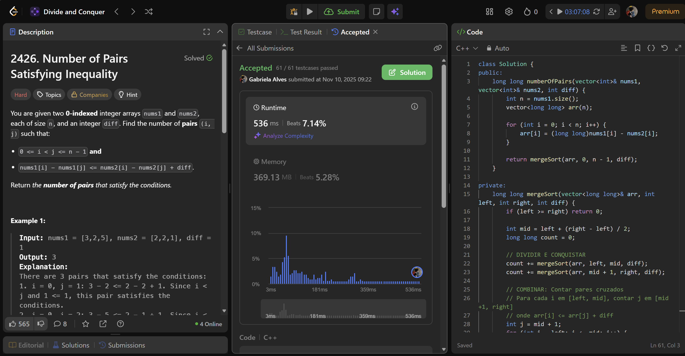
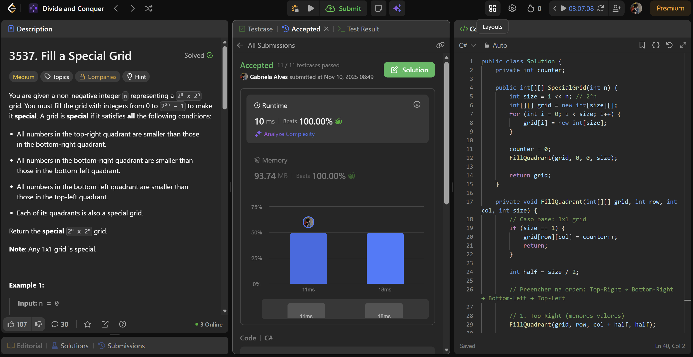

# LeetCodeQuestions - DIVIDIR E CONQUISTAR

**Conteúdo da Disciplina**: Dividir e Conquistar<br>

## Alunos

| Matrícula  | Aluno                |
| ---------- | -------------------- |
| 21/1031673 | Cauã Matheus         |
| 21/1030756 | Gabriela Silva Alves |

## Sobre

Este repositório apresenta soluções para quatro problemas do LeetCode, organizadas por linguagem e nível de dificuldade:

### C++

- [2426. Number of Pairs Satisfying Inequality](https://leetcode.com/problems/number-of-pairs-satisfying-inequality/description/) **(Hard)**

---

### C\#

- [3537. Fill a Special Grid](https://leetcode.com/problems/fill-a-special-grid/description/) **(Medium)**

- [1985. Find the Kth Largest Integer in the Array](https://leetcode.com/problems/find-the-kth-largest-integer-in-the-array/description/) **(Medium)**

## Screenshots

### Visualização 

#### C++

- Number of Pairs Satisfying Inequality


#### C\#

- Fill a Special Grid


- Find the Kth Largest Integer in the Array


---

## Instalação

**Linguagem**: C++ e C# <br>

**Pré-requisitos:**

- .NET SDK: versão 10
- Ferramentas de linha de comando: git, bash (ou terminal equivalente)

## Passo a passo

### 1. Clone o repositório

### 2. Compilar e executar C++

Os comandos a seguir devem ser executados a partir da raiz do repositório clonado.
> OBS.: Para submssão em juízes como leetcode, submeter apenas classe Solution.

#### Executando as Soluções

#### **2426. Number of Pairs Satisfying Inequality**

Para compilar e executar a validação desta questão, utilize o makefile ou utilize o comando a seguir:

```bash
g++ ./solutions/cpp/NumberOfPairs.cpp -o ./out.o && ./out.o && rm ./out.o
```

### 3. Compilar e executar soluções C#

Os comandos a seguir devem ser executados a partir da raiz do repositório clonado.
> OBS.: Para submssão em juízes como leetcode, submeter apenas classe Solution.

#### Executando as Soluções

#### **3537. Fill a Special Grid**

Para compilar e executar a validação desta questão, utilize o comando:

```bash
dotnet run --project solutions/csharp/FillSpecialGrid
```

#### **1985. Find the Kth Largest Integer in the Array**

Para compilar e executar a validação desta questão, utilize o comando:

```bash
dotnet run --project solutions/csharp/FindKth
```

## Apresentação

Vídeo disponível em: [Apresentação D16](https://youtu.be/)

## Outros

Para dúvidas, sugestões ou melhorias, entre em contato com os autores.


